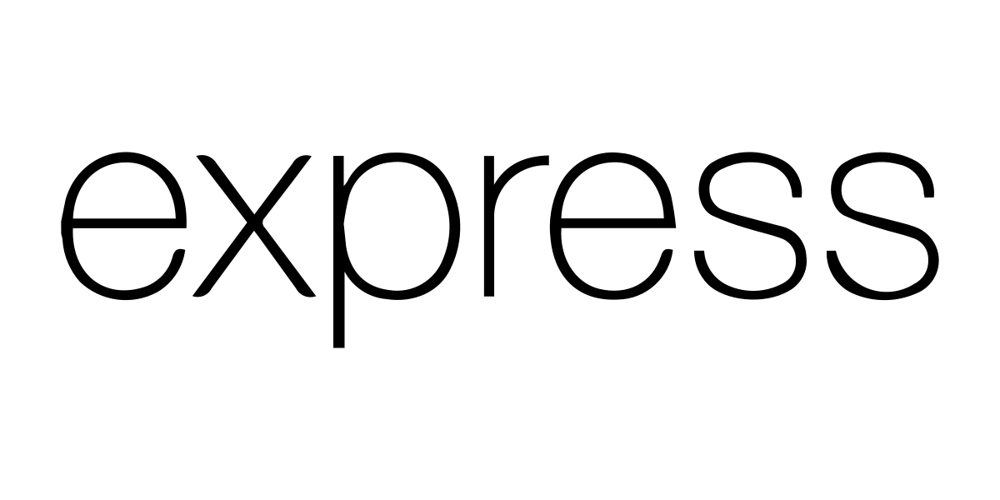
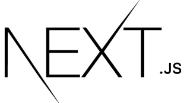

<h1 align="center">Hey there! I'm Priyanshu Pattanaik 😀</h1>
<h3 align="center">A full-stack Web Developer exploring ML, an aspiring entrepreneur, and a blogger.</h3>

  

🛠️ I'm a **Developer Advocate Intern** at Open Weaver.

🔭 I’m currently tinkering with **Next.js, Three.js and ML**

🙌 I’m looking to collaborate on projects related to **Web Development, UI/UX designing or Machine Learning**

📝 I occasionally write blogs on [https://medium.com/@Priyanshu1011](https://medium.com/@Priyanshu1011)

💬 I'm open to conversations about **MERN stack, C/C++, Entrepreneurship**

✉️ Reach out to me at **priyanshu.pattanaik1011@gmail.com**

📄 My experiences in brief: [Resume](https://drive.google.com/file/d/16dvY70c4VmmArk-7PnX-eUaE2oYH3G03/view)

<h2 align="left">Connect with Me</h2>

&nbsp;
&nbsp;
&nbsp;
&nbsp;

<h2 align="left">Languages and Tools</h2>
<h4 align="left">Web Development</h4>
&nbsp;
&nbsp;
&nbsp;
&nbsp;
&nbsp;
&nbsp;
&nbsp;
&nbsp;
&nbsp;
&nbsp;
&nbsp;
&nbsp;
&nbsp;
&nbsp;
<h4 align="left">Programming</h4>
&nbsp;
&nbsp;
&nbsp;
&nbsp;
<h4 align="left">Machine Learning</h4>
&nbsp;
&nbsp;
&nbsp;
<h4 align="left">Design</h4>
&nbsp;
 

### My Latest Blog Posts
<!-- BLOG-POST-LIST:START -->
- [Time Management for Founders: Juggling Tasks Effectively](https://medium.com/@Priyanshu1011/time-management-for-founders-70e795918905?source=rss-85dab7c97519------2)
- [Sustainable Business Practices: Balancing Profit and Impact](https://medium.com/@Priyanshu1011/sustainable-business-practices-b35f10de0a77?source=rss-85dab7c97519------2)
- [Managing Business Risks: Strategies for Uncertain Times](https://medium.com/@Priyanshu1011/managing-business-risks-strategies-for-uncertain-times-5f2096093c7e?source=rss-85dab7c97519------2)
- [Funding Roundup: Pros and Cons of Different Funding Rounds](https://medium.com/@Priyanshu1011/pros-and-cons-of-different-funding-rounds-7d659e87f7c1?source=rss-85dab7c97519------2)
- [Financial Management and Sustainability](https://medium.com/@Priyanshu1011/financial-management-and-sustainability-8fd121afee17?source=rss-85dab7c97519------2)
<!-- BLOG-POST-LIST:END -->

<h2 align="left">GitHub Stats</h2>

&nbsp;

  

